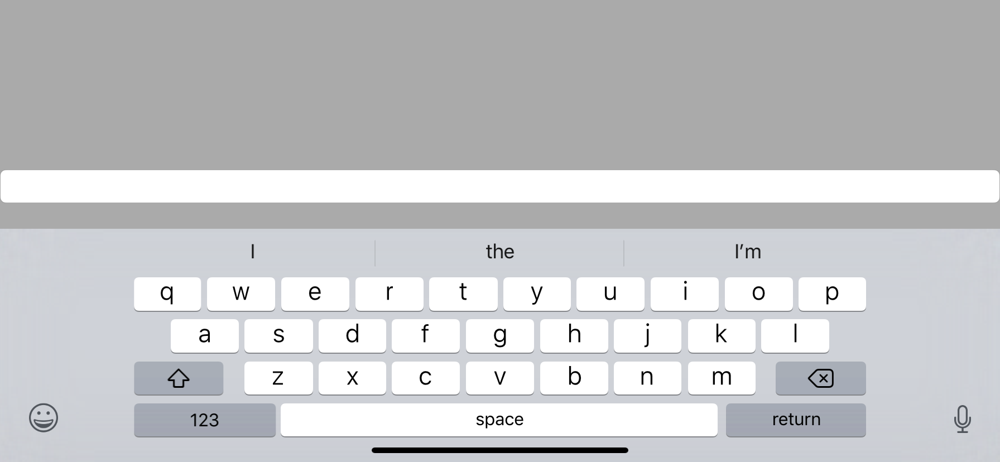

# IQKeyboardManagerBugTest
Demonstrates a bug with safe area insets inside IQKeyboardManager where upon scrolling the view, the safe area insets are set to zero.

Launch the app in any simulator with a notch, such as the iPhone X.  Bring up the keyboard and you'll see the safe area insets are set to CGRect.zero for some reason, and when the keyboard is dismissed it sets itself back to the appropriate rect.  Below are screenshots of the issue, notch not pictured.  The text field is simply pinned to the safe area leading and trailing.

Expectation is that the safe are will continue to be respected.

